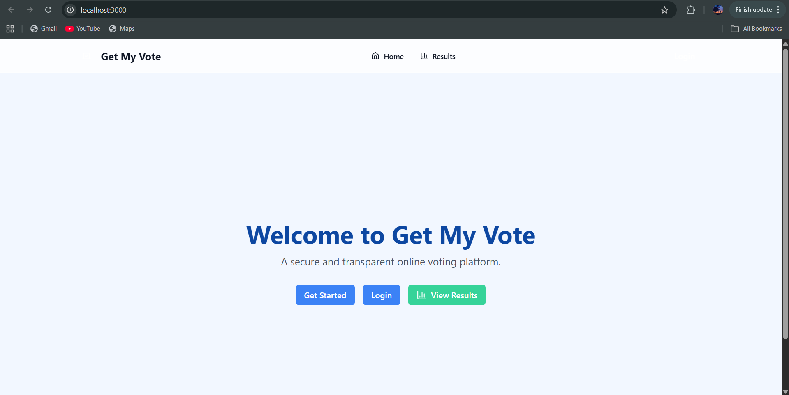
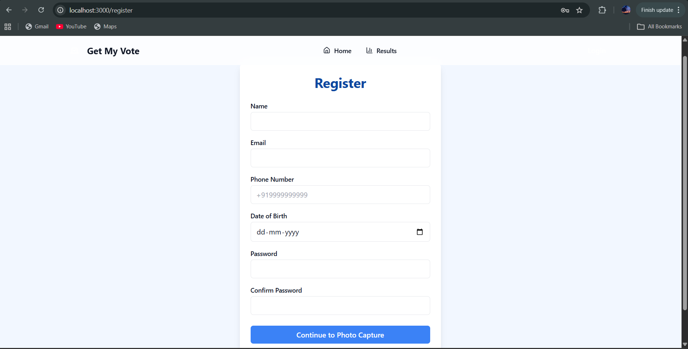
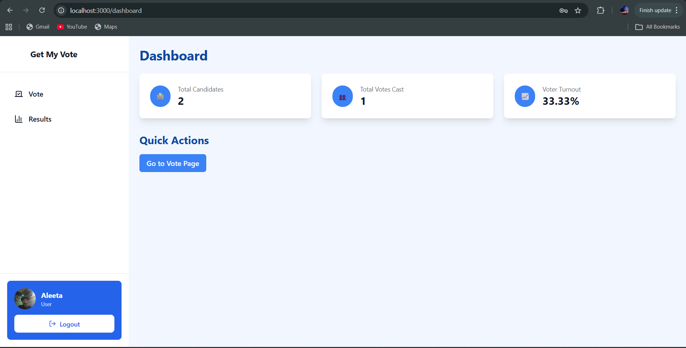
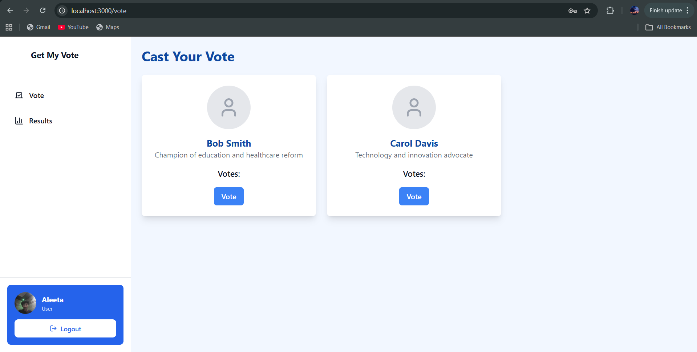
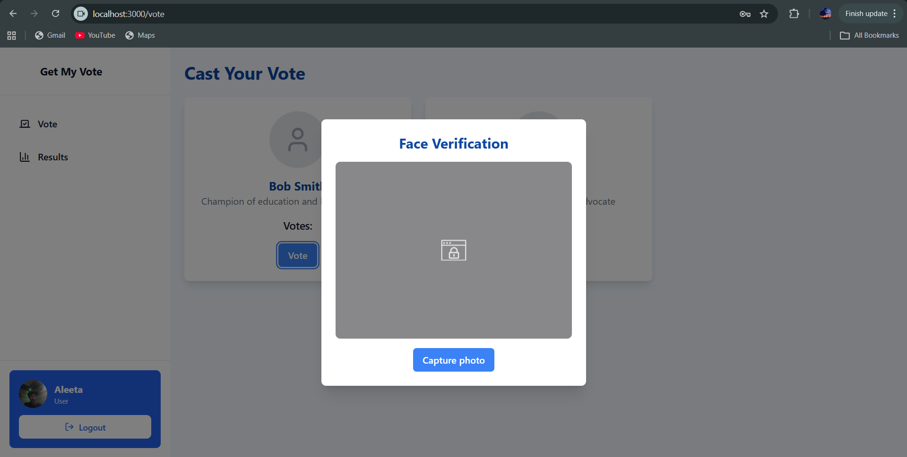
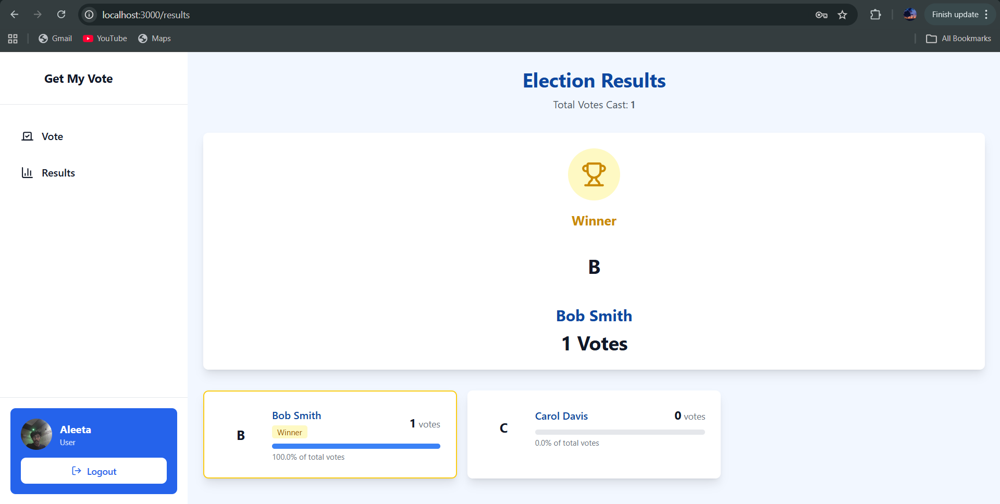
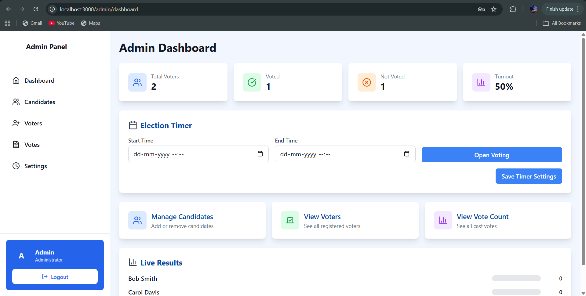
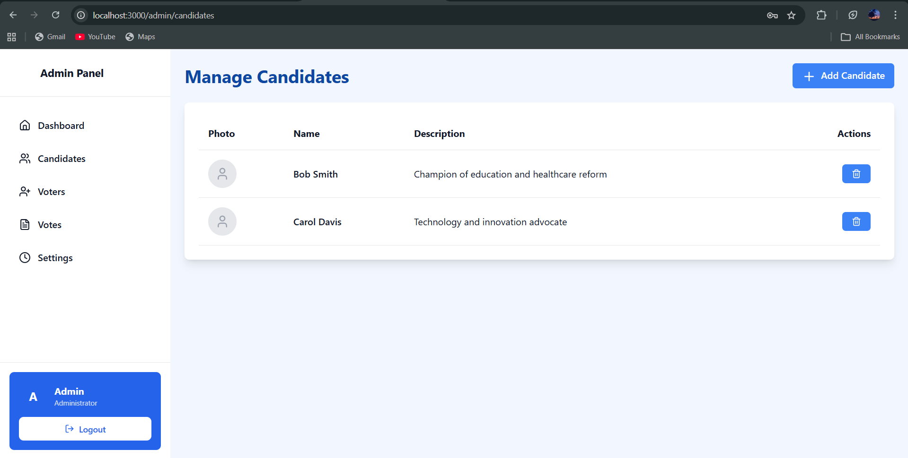

# Get My Vote

A secure full-stack online voting platform with biometric verification. The system enables authenticated voters to cast exactly one vote using OTP verification and facial recognition, while providing administrators with tools to manage elections, candidates, and voter activity.

The project demonstrates the integration of modern web technologies, authentication systems, and computer vision to address core challenges in digital voting systems such as identity verification, vote integrity, and administrative control.

---

# Overview

Get My Vote is designed to simulate a secure digital election platform. The system allows voters to register, verify their identity, and participate in an election remotely while ensuring that each voter can vote only once.

The platform combines several layers of security including:

- Email and SMS OTP verification
- JWT based authentication
- Password hashing using bcrypt
- Face recognition verification
- Duplicate vote prevention using database constraints

The system also provides an administrative interface to manage election configuration and monitor voting activity.

---

# Screenshots

## Landing Page


## User Registration


## OTP Verification


## User Dashboard


## Voting Interface


## Face Verification


## Election Results


## Admin Dashboard


## Candidate Management


---

# Key Features

## Authentication and Verification

- User registration with OTP verification via email or SMS
- Secure login using JWT authentication
- Password hashing using bcrypt
- Role-based access control

## Voting System

- One person one vote enforcement
- Candidate selection interface
- Face verification during voting
- Vote recording with duplicate prevention

## Administrative Controls

- Candidate management
- Voter monitoring
- Election status control (open or close voting)
- Voting statistics and results tracking

## Security

- Rate limiting for API requests
- JWT token expiration
- Multi-layer duplicate vote protection
- Biometric verification using facial recognition

---

# System Architecture

The project follows a client–server architecture.

Frontend handles user interaction and UI rendering.  
Backend manages authentication, voting logic, API endpoints, and face recognition.  
MongoDB stores users, candidates, votes, and system settings.

```
Frontend (React)
       |
       | REST API
       |
Backend (Flask)
       |
       |
Database (MongoDB)
       |
       |
External Services
SendGrid – Email OTP
Twilio – SMS OTP
OpenCV – Face Detection
```

---

# Technology Stack

## Frontend

- React
- Tailwind CSS
- Axios
- React Hook Form
- React Webcam
- Framer Motion
- Recharts
- Vite

## Backend

- Flask
- Python
- PyMongo
- PyJWT
- Bcrypt
- OpenCV
- Pillow

## Database

- MongoDB

## External Services

- SendGrid for email based OTP delivery
- Twilio for SMS OTP delivery

---

# Face Recognition Methodology

The system integrates basic computer vision techniques for identity verification during the voting process.

## Face Detection

The application uses OpenCV Haar Cascade classifiers to detect faces from webcam images captured during registration or voting.

## Processing Pipeline

1. Capture image using the user's webcam
2. Convert image to grayscale
3. Detect face region using Haar Cascade classifier
4. Extract face region of interest
5. Resize face image to a fixed dimension
6. Store the face image on the server

## Face Verification

During voting, the system compares the captured face image with the previously stored face image using histogram correlation.

If the similarity score exceeds a predefined threshold, the system confirms the user's identity and allows the vote to proceed.

---

# Voting Methodology

The voting workflow is designed to ensure integrity and prevent duplicate voting.

## Voting Process

1. User registers and verifies their account using OTP
2. User logs in using credentials
3. User accesses the voting dashboard
4. System verifies that voting is currently open
5. User selects a candidate
6. Face verification is performed
7. Vote is recorded in the database
8. User is marked as having voted

---

# Duplicate Vote Prevention

The system enforces one-person-one-vote using multiple mechanisms.

## User Voting Status

Each user record contains a flag indicating whether the user has already voted.

## Votes Collection Constraint

The votes collection stores the user ID and candidate ID. Database checks ensure that only one vote can be recorded per user.

## Backend Validation

Before recording a vote, the backend verifies:

- the user exists
- the user is verified
- voting is open
- the user has not voted previously

---

# Database Design

## Users Collection

Stores voter information and authentication data.

Key Fields:

- name
- email
- phone
- password_hash
- role
- hasVoted
- isVerified
- createdAt

## Candidates Collection

Stores election candidates.

Key Fields:

- name
- description
- photo
- voteCount

## Votes Collection

Stores voting records.

Key Fields:

- user_id
- candidate_id
- timestamp

## Settings Collection

Stores election configuration.

Key Fields:

- electionName
- votingOpen
- updatedAt

---

# API Design

The backend exposes RESTful API endpoints.

## Authentication

POST /api/auth/register  
POST /api/auth/login  
POST /api/auth/verify-otp  

## Voting

GET /api/vote/candidates  
POST /api/vote/cast  
GET /api/vote/stats  

## Administration

GET /api/admin/dashboard  
POST /api/admin/candidates  
PUT /api/admin/candidates/:id  
DELETE /api/admin/candidates/:id  
POST /api/admin/settings  

---

# Security Considerations

The system implements several security mechanisms.

## Password Security

User passwords are hashed using bcrypt before storage.

## JWT Authentication

Authentication tokens are generated during login and used for accessing protected endpoints.

## Rate Limiting

API endpoints enforce request limits to prevent abuse.

## Role-Based Access Control

Administrative operations are restricted to users with the admin role.

---

# Project Structure

```
Voting
│
├── backend
│   ├── app.py
│   ├── routes
│   ├── services
│   ├── models
│   ├── middleware
│   ├── database
│   └── utils
│
├── frontend
│   ├── src
│   │   ├── components
│   │   ├── pages
│   │   ├── hooks
│   │   ├── context
│   │   └── api
│
├── screenshots
│   ├── landing.png
│   ├── register.png
│   ├── otp.png
│   ├── dashboard.png
│   ├── vote.png
│   ├── face-verification.png
│   ├── results.png
│   └── admin-dashboard.png
│
└── README.md
```

---

# Running the Project

## Backend Setup

```
cd backend
python -m venv .venv
pip install -r requirements.txt
python run.py
```

## Frontend Setup

```
cd frontend
npm install
npm run dev
```

---

# Future Improvements

Several enhancements can improve the system further.

- Deep learning based facial recognition models such as FaceNet or ArcFace
- Liveness detection to prevent spoofing attacks
- Real-time vote updates using WebSockets
- Blockchain based vote storage for tamper resistance
- Mobile application support

---

# Disclaimer

This project is intended for educational and research purposes. It demonstrates the architecture and implementation of a digital voting system but should not be used for real elections without extensive security, privacy, and compliance enhancements.
